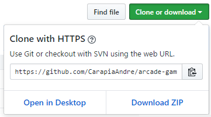

# Clone do Clássico Game Arcade

 Esse game foi um clone do clássico Arcade Game, tendo como principal objetivo explorar Javascript Orientado a Objeto.

 ## Instalando o Jogo

  1. Clique em "Clone Or Download" nesta [página](https://github.com/CarapiaAndre/arcade-game) do GitHub  
  

  2. Selecione Download ZIP se não usar Git ou SVN, caso contrário basta copiar a [URL](https://github.com/CarapiaAndre/arcade-game.git) para clonar o repositório.

  3. Descompacte o jogo.

  4. Basta abrir o arquivo **index.html**

  ## Jogando

    ### Regras

      1. **Jogabilidade** - Utilize as setas do teclado para mover o personagem. :arrow_up::arrow_right::arrow_down::arrow_left:

      2. **Objetivo** - Atravessar o personagem até o lago. :running:

      3. **Obstaculos** - Cuidado! Possuem joaninhas gigantes que você deve evitar colidir. :beetle:

      4. **Pontuação** - Cada atravessia sem colidir com inimigos contabiliza uma vitória, cada vez que você colidir com uma joaninha gigante contará uma morte. :video_game:

    Aproveite! Faça o máximo de pontos que conseguir com o menor número de mortes possíveis! :thumbsup:
